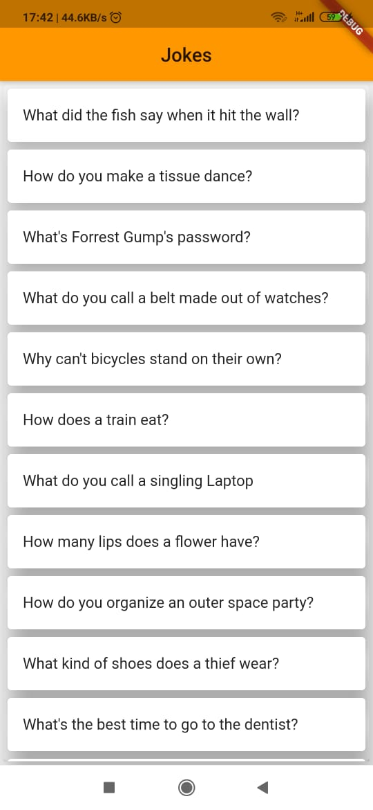
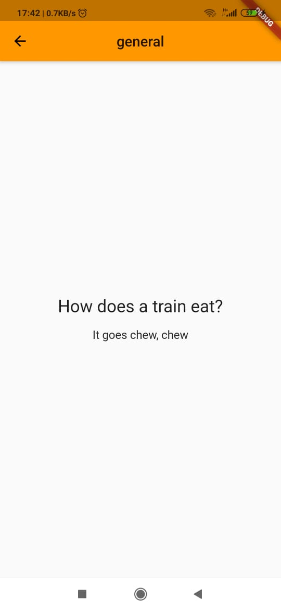
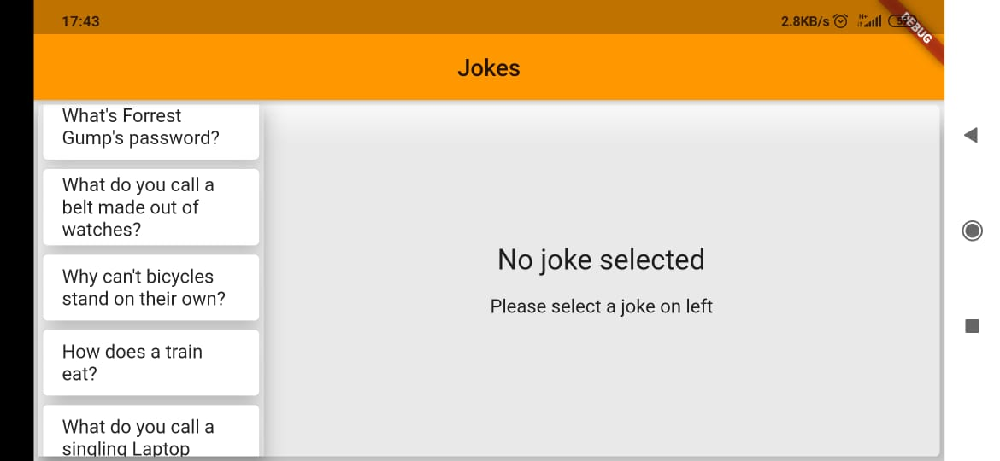
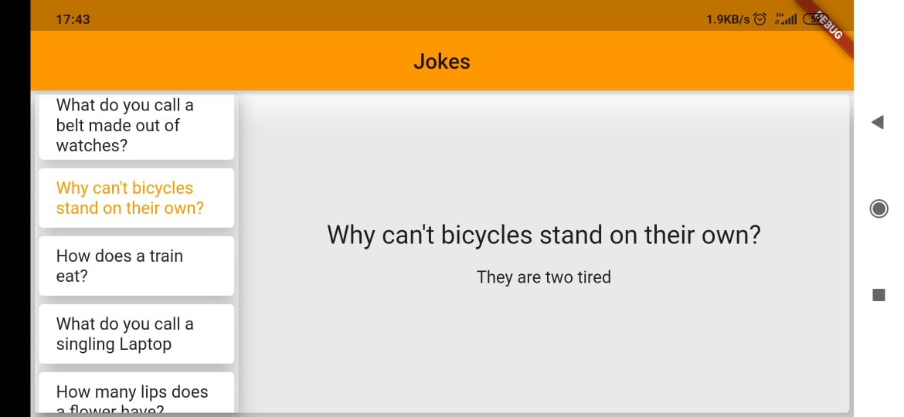

# jokes_app_orientation

A new Flutter project. 
A simple jokes app, its main motive is to learn the orientation or the presentation data in both mobile phone and in tablet. 
In mobile if the orientation is potrait the list will route to a new screen as shown below in screen shots,
## potrait
|

but if the orientation is in landscape mode then the list will be displayed on left side and the context of that list will be displayed on the right side

## landscape
|

A another way of orientation is to view in tablet which has a quite broad screen and has more Pexels thus the way of presentation will be as a landscape presentation in mobile. 

## Getting Started

This project is a starting point for a Flutter application.

A few resources to get you started if this is your first Flutter project:

- [Lab: Write your first Flutter app](https://flutter.dev/docs/get-started/codelab)
- [Cookbook: Useful Flutter samples](https://flutter.dev/docs/cookbook)

For help getting started with Flutter, view our
[online documentation](https://flutter.dev/docs), which offers tutorials,
samples, guidance on mobile development, and a full API reference.
